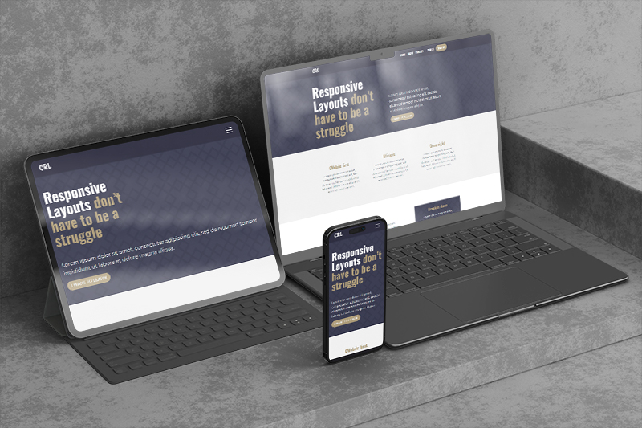
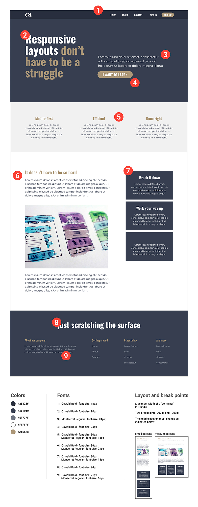
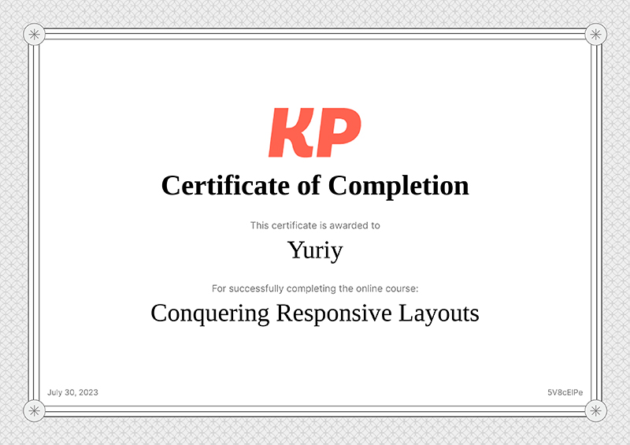

# KP_Responsive-Layouts
* HTML
* CSS
* JS just for mobile nav
## [Conquering Responsive Layouts](https://kp-responsive-layouts-challenge.netlify.app/)

[https://kp-responsive-layouts-challenge.netlify.app/](https://kp-responsive-layouts-challenge.netlify.app/)

###
One of the most frequently cited excuses for adopting a desktop-first approach is that it aligns with the design provided. Nevertheless, as we've explored the possibilities of mobile-first development, we can still effectively handle this situation. Let's put this knowledge into action!

Imagine the black box surrounding the design as our viewport. The content inside should be confined to the maximum width specified in the design specifications. However, we want the backgrounds to expand seamlessly to the edges of the viewport, regardless of its size.

Fortunately, the design has outlined two specific breakpoints to utilize. While some minor adjustments may be acceptable, our goal is to stay within those general ranges. With a mobile-first mindset, we'll be well-equipped to create a responsive and visually appealing user experience across various devices.

## My certificate

